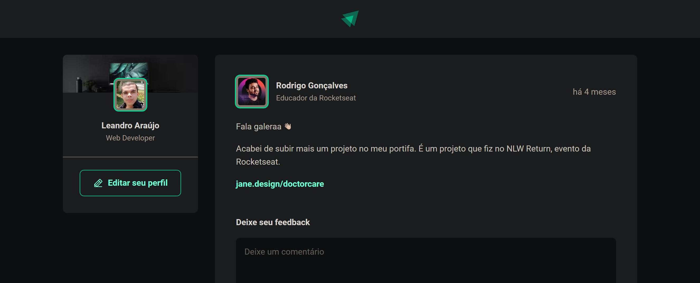

<h1 style="text-align: center; font-weight: bold;">Rede social</h1>

## Demonstração 📸

  

---

## Sobre o Projeto

Plataforma realizada no Ignite da Rocketseat, que permite adicionar, excluir e curtir comentários.  Esse projeto foi realizado primeiramente com Javascript e, posteriormente, com Typescript.

Link para a visualização do projeto: https://rede-social-psi.vercel.app/

### 🛠 Tecnologias

As seguintes ferramentas foram usadas na construção do projeto:

- [Javascript]
- [Typescript]
- [React]
- [React-Hooks]
- [Styled-components]
- [date-fns]
- [phosphor-react]
---

 

Veja meu Linkedin: [LEANDRO ARAÚJO](http://www.linkedin.com/in/leandro-ara%C3%BAjo-da-silva-1660631b9)